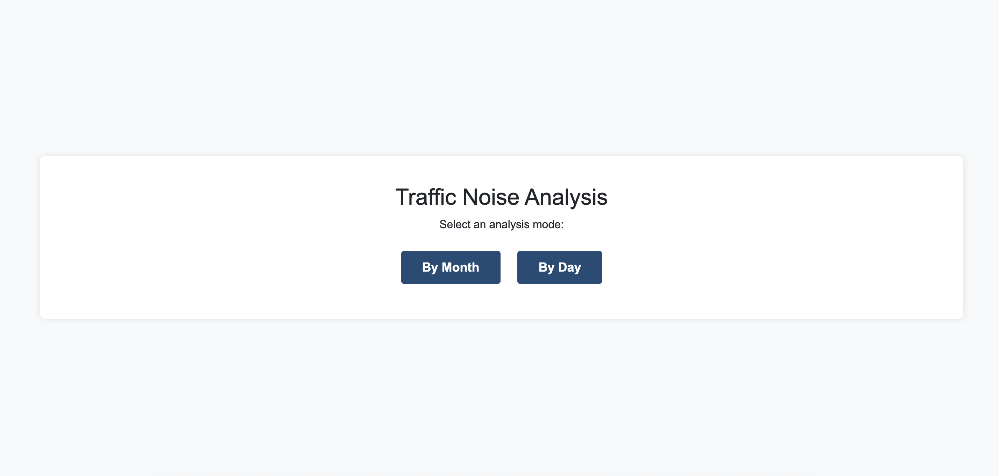
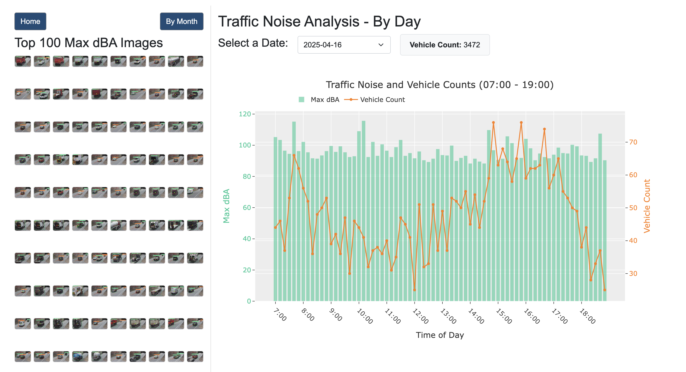
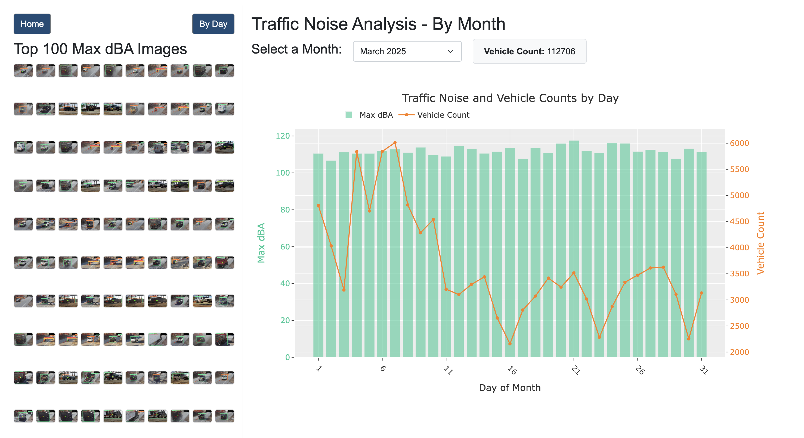
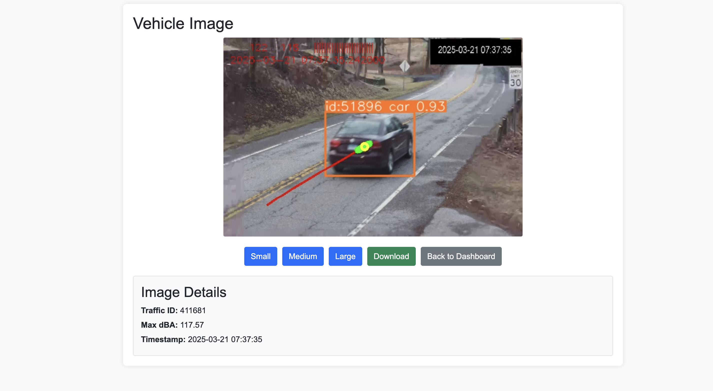
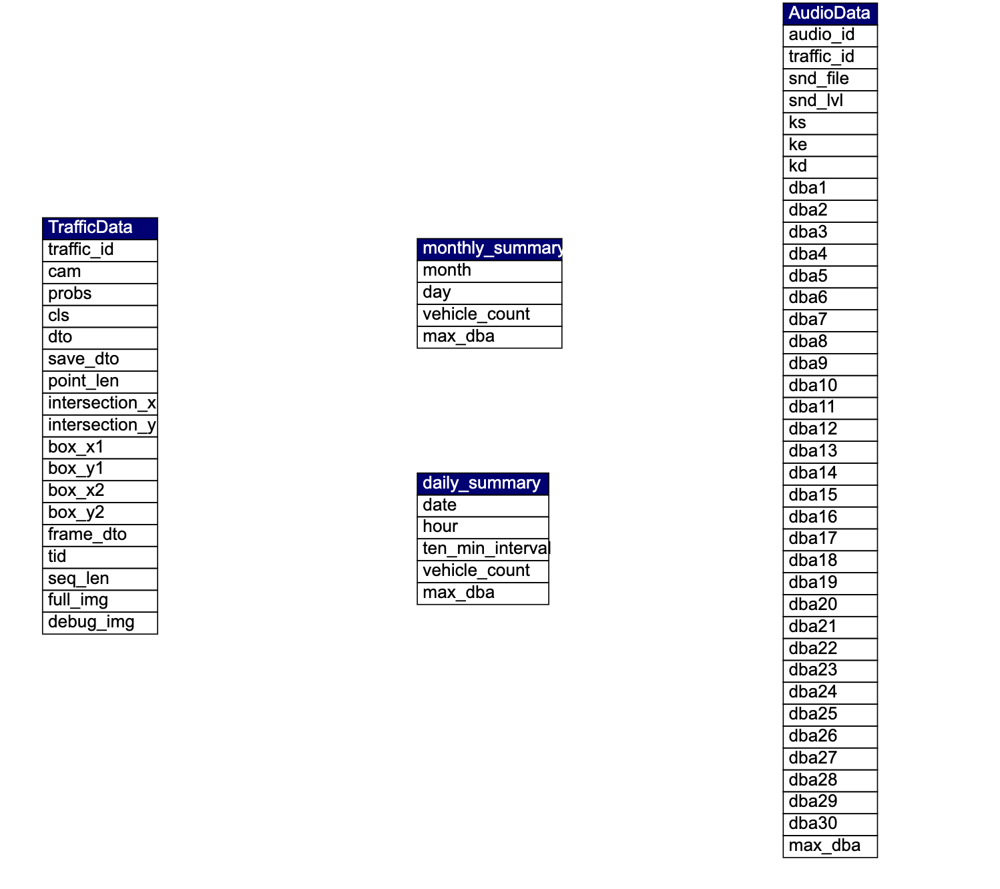
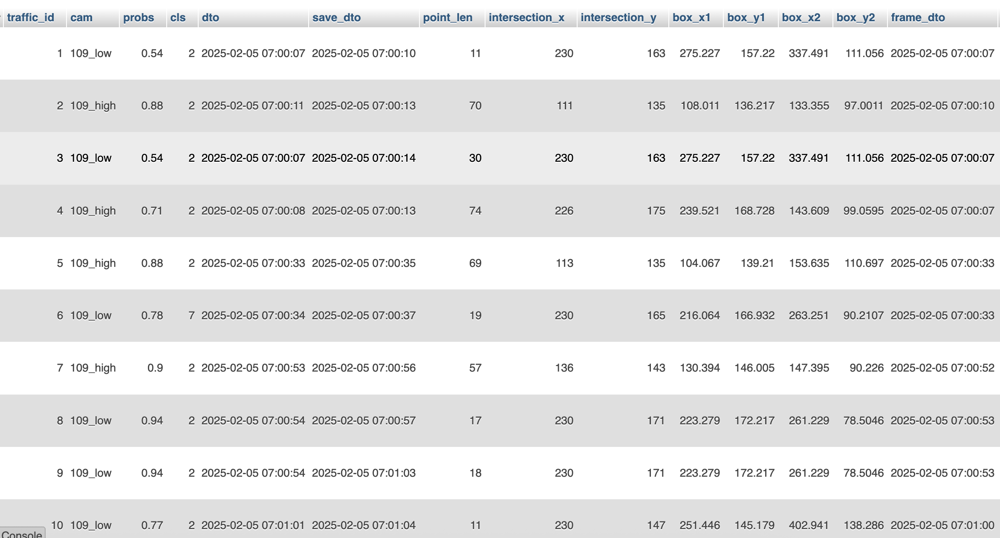
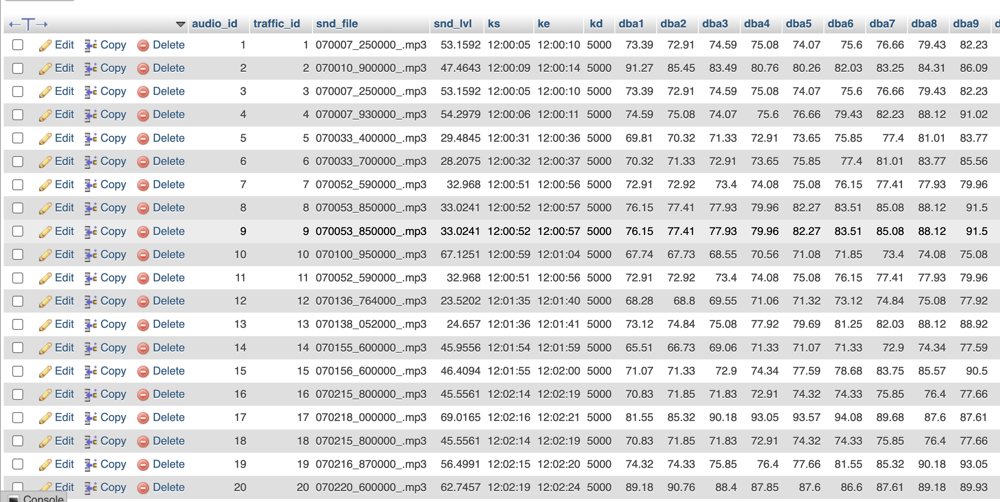
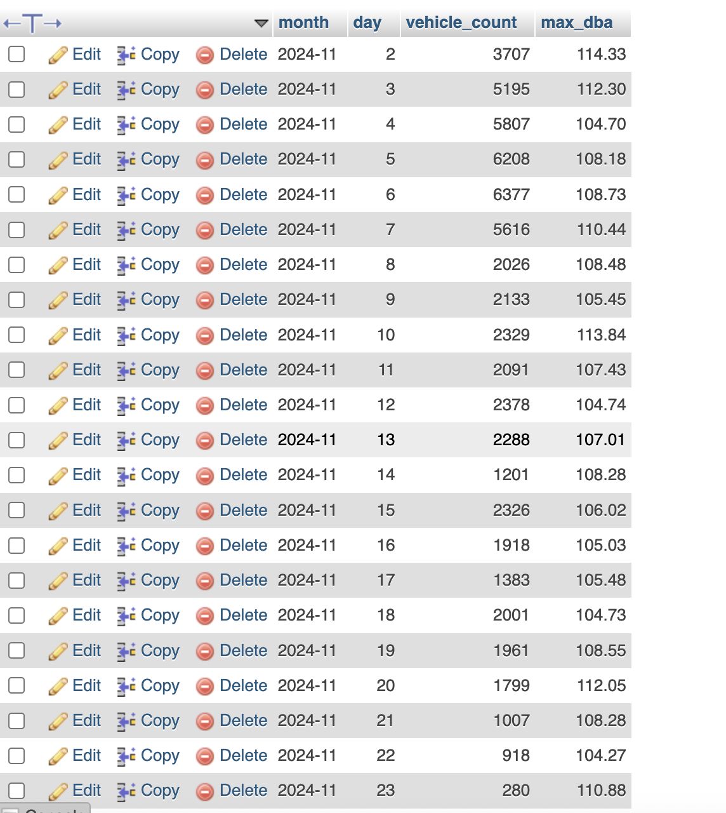
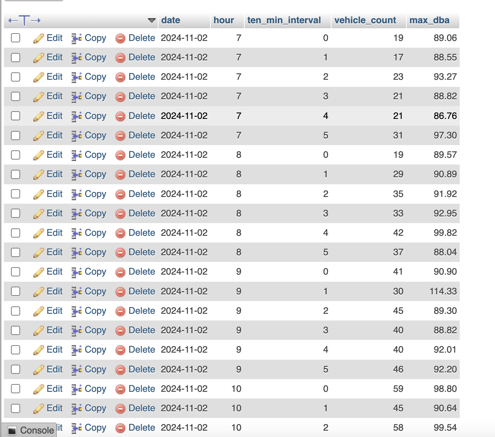

# Traffic Noise Analysis Dashboard

## 1. Project Overview
The Traffic Noise Analysis dashboard is a capstone project designed to analyze urban traffic and noise data, featuring a MySQL database and a Flask-based web dashboard with interactive visualizations of vehicle counts and noise levels (measured in decibels, dBA). By integrating data from traffic cameras and audio sensors, the system provides insights into traffic patterns and environmental noise at urban intersections. The project employs a MySQL database for efficient data storage and a user-friendly web dashboard for exploring data aggregated by day or month, visualizing trends through graphs, and inspecting images associated with high noise levels.

**Objectives**:
- Develop an efficient system for collecting and storing traffic and audio data.
- Process data to generate actionable summaries for urban analysis.
- Deliver an intuitive web interface for data visualization and image inspection.
- Ensure scalability to accommodate new data over time.

### 1.1 Dashboard User Guide
The web dashboard is the primary interface for users to interact with traffic and noise data. Hosted at `http://localhost:5000` after launching the Flask application, it offers an intuitive platform for data exploration. This section provides a step-by-step guide to navigating and utilizing the dashboard.

**Navigation Steps**:
1. **Access the Home Page**:
   - Visit `http://localhost:5000/` to access the home page.
   - The interface features navigation links or buttons to the **Daily Analysis** (`/by_day`) or **Monthly Analysis** (`/by_month`) views.
   
2. **Daily Analysis**:
   - Navigate to `/by_day`.
   - Select a date from the dropdown menu to view data for that day.
   - Hover over graph data points to inspect vehicle counts and max dBA values.
   - Click image thumbnails in the grid to view details of high-noise events.
   
3. **Monthly Analysis**:
   - Navigate to `/by_month`.
   - Choose a month (e.g., “April 2025”) from the dropdown menu.
   - Hover over the graph to examine daily vehicle counts and max dBA values.
   - Click image thumbnails for detailed event information.
   
4. **Image Details**:
   - From either analysis view, click a thumbnail to access `/view_image/<traffic_id>`.
   - Use controls to resize or download the image as a JPEG.
   
5. **Dynamic Interaction**:
   - Date or month selections trigger instant graph and summary updates via AJAX, ensuring a seamless experience.

**Purpose**:
This guide enables users to efficiently explore traffic and noise patterns, leveraging the dashboard’s interactive visualizations and image inspection capabilities.

## 2. System Architecture
This section outlines the system’s architecture, detailing the components and their interactions to achieve the project’s objectives.

The system operates through a structured pipeline:
1. **Data Collection**: Initial data is stored in `logs/`, with new data downloaded to `newdata/` via FileZilla.
2. **Database Management**: The `initial_data_setup.ipynb` script creates the MySQL database schema and populates it with initial data.
3. **Data Updates**: The `new_data_insertion.ipynb` script processes new data files, updating the database.
4. **Visualization**: The Flask application (`app.py`) serves a web dashboard with HTML templates for data analysis and image display.

**Components**:
- **Database**: MySQL (`gonuguc_Traffic_Capstone`) for storing traffic, audio, and summary data.
- **Scripts**: Jupyter notebooks for data processing and database management.
- **Dashboard**: Flask-based web interface with Plotly graphs and Bootstrap styling.
- **File Repository**: External server (`https://filerepo.clarksonmsda.org:444/fetch/`) for image storage.

## 3. Data Flow
The data flow ensures seamless integration from collection to visualization:
1. **Acquisition**:
   - Initial data: `logs/`.
   - New data: Downloaded from `/srv/sftpgo/data/users/gonuguc@clarkson.edu/traffic/logs` to `newdata/`.
2. **Processing**:
   - `initial_data_setup.ipynb`: Processes initial JSON files and populates the database.
   - `new_data_insertion.ipynb`: Handles new data with incremental `traffic_id` assignment.
3. **Storage**:
   - Data stored in `TrafficData`, `AudioData`, `monthly_summary`, and `daily_summary` tables.
4. **Visualization**:
   - Dashboard queries the database for graphs and image grids.
   - Images retrieved via encrypted URLs from the file repository.

## 4. Methodology
The methodology formalizes the approach to data processing, database design, and dashboard development:
- **Data Processing**:
  - JSON files are parsed to extract traffic (e.g., vehicle coordinates, timestamps) and audio (e.g., dBA levels, timestamps) data.
  - Records are filtered for valid audio data.
  - Summaries are computed for daily (10-minute intervals) and monthly (daily) aggregations.
- **Database Design**:
  - Normalized tables (`TrafficData`, `AudioData`) store raw data, linked by `traffic_id`.
  - Summary tables (`monthly_summary`, `daily_summary`) optimize visualization queries.
  - Indexes on `traffic_id`, `max_dba`, and `dto` enhance performance.
- **Dashboard Development**:
  - Flask serves HTML templates with Plotly for graphs and Bootstrap for responsive design.
  - AJAX enables dynamic updates.
  - Image fetching uses encrypted URLs with error handling.

## 5. Implementation Details
This section details the technical implementation of the project’s components.

### 5.1 Database Setup and Initial Data Insertion
The `initial_data_setup.ipynb` script initializes the database and populates it with data from `logs/`.

**Code Snippet**:
```python
# initial_data_setup.ipynb
import json
import os
import pymysql
import pandas as pd
from datetime import timedelta, datetime
import yaml

# Load configuration
config = yaml.safe_load(open('config.yml', 'r'))
db_config = config['database']
folder_path = config['paths']['logs']

# Data Handling
file_list = [i for i in os.listdir(folder_path) if '.txt.' in i]
data = []
for file_name in file_list:
    file_path = os.path.join(folder_path, file_name)
    with open(file_path, 'r') as f:
        lines = []
        for line in f.read().split('\n')[:-1]:
            try:
                c = json.loads(line)
                lines.append(c)
            except json.JSONDecodeError as e:
                print(f'File: {file_name}, Invalid JSON: {line[:100]}, Error: {e}')
        print(f'Size of file "{file_name}": {len(lines)}')
        data.extend(lines)

# Filter rows with audio data
data = [i for i in data if 'res' in i['snd'].keys()]

# Database Setup
conn = pymysql.connect(**db_config, autocommit=True)
cur = conn.cursor(pymysql.cursors.DictCursor)

# Create TrafficData table
cur.execute("""
CREATE TABLE TrafficData (
    traffic_id INT NOT NULL,
    cam VARCHAR(50),
    probs FLOAT,
    cls INT,
    dto DATETIME,
    save_dto DATETIME,
    point_len INT,
    intersection_x INT,
    intersection_y INT,
    box_x1 FLOAT,
    box_y1 FLOAT,
    box_x2 FLOAT,
    box_y2 FLOAT,
    frame_dto DATETIME,
    tid INT,
    seq_len INT,
    full_img VARCHAR(500),
    debug_img VARCHAR(500),
    PRIMARY KEY(traffic_id)
);
""")
# ... (table creation and insertion)
```

**Process**:
- Parses JSON files for traffic and audio data.
- Creates tables with indexes and primary keys.
- Filters for audio data.
- Uses pandas for summary computations.
- Employs bulk inserts for efficiency.

### 5.2 New Data Insertion
The `new_data_insertion.ipynb` script updates the database with new data from `newdata/`.

**Code Snippet**:
```python
# new_data_insertion.ipynb
import json
import os
import pymysql
from datetime import timedelta, datetime
import yaml

# Load configuration
config = yaml.safe_load(open('config.yml', 'r'))
db_config = config['database']
folder_path = config['paths']['newdata']
file_list = [i for i in os.listdir(folder_path) if '.txt.' in i]

data = []
for file_name in file_list:
    file_path = os.path.join(folder_path, file_name)
    with open(file_path, 'r') as f:
        try:
            lines = [json.loads(line) for line in f.read().split('\n')[:-1] if line]
            print(f'Size of the file "{file_name}": {len(lines)}')
            data.extend(lines)
        except Exception as e:
            print(f'Error with file {file_name}: {e}')

# Filter rows with audio data
data = [i for i in data if 'res' in i['snd'].keys()]

# Connect to SQL database
conn = pymysql.connect(**db_config, autocommit=True)
cur = conn.cursor(pymysql.cursors.DictCursor)

# Get the maximum traffic_id
cur.execute("SELECT MAX(traffic_id) as max_id FROM TrafficData")
result = cur.fetchone()
traffic_id_counter = result['max_id'] + 1 if result['max_id'] is not None else 1
```

**Process**:
- Reads JSON files from `newdata/`.
- Filters for audio data.
- Assigns incremental `traffic_id` values.
- Aggregates summaries using dictionaries.
- Inserts data in bulk.

### 5.3 Dashboard Implementation
The `app.py` script implements the Flask-based dashboard, serving HTML templates for visualization and interaction.

**Code Snippet**:
```python
# app.py
from flask import Flask, request, jsonify, render_template
import pymysql
import yaml
import plotly.graph_objs as go
import json

app = Flask(__name__)

# Load configuration
config = yaml.safe_load(open('config.yml', 'r'))
KEY = config['key'].encode('utf-8')
db_config = config['database']

@app.route('/')
def home():
    return render_template('home.html')

@app.route('/by_day')
def by_day():
    conn = pymysql.connect(**db_config, autocommit=True)
    cur = conn.cursor(pymysql.cursors.DictCursor)
    cur.execute("SELECT DISTINCT date FROM daily_summary ORDER BY date")
    all_dates = [row['date'].strftime('%Y-%m-%d') for row in cur.fetchall()]
    cur.close()
    conn.close()
    return render_template('dashboard_day.html', all_dates=all_dates)
```

**Frontend Features and Visualizations**:
The dashboard offers a rich user experience through:
- **Home Page (`home.html`)**:
  - A clean interface with navigation links to analysis views.
- **Daily Analysis (`dashboard_day.html`)**:
  - Plotly graph with bars for max dBA and a line for vehicle counts per 10-minute interval.
  - Date dropdown, vehicle count summary, and clickable image grid (top 100 max dBA).
- **Monthly Analysis (`dashboard_month.html`)**:
  - Plotly graph with daily max dBA bars and vehicle count line.
  - Month dropdown, vehicle count summary, and image grid.
- **Image View (`view_image.html`)**:
  - Displays an image with traffic ID, max dBA, and timestamp, plus resize/download controls.

**Frontend Features and Improvements**:
- **Interactivity**: Plotly graphs support zooming, panning, and hovering; AJAX ensures real-time updates.
- **Responsiveness**: Bootstrap adapts the layout to various devices.
- **Image Handling**: Secure fetching with error handling for failed loads.
- **Usability**: Readable dropdown formats, clear navigation, consistent styling.
- **Performance**: Optimized queries and graph rendering for fast load times.
- **Enhancements**: Improved error messages, faster AJAX updates, sorted dropdowns, and added image controls.

## 6. Database Schema
The MySQL database (`gonuguc_Traffic_Capstone`) includes four tables:

**Relational Schema**:


### Traffic Data Table

### Audio Data Table

### Monthly Summary Table

### Daily Summary Table


## 7. SQL Queries
The `traffic_queries.sql` file lists all queries with comments.


## 8. Setup and Deployment
### Prerequisites
- **MySQL Database**: `mysql.clarksonmsda.org:3306` with `config.yml` credentials.
- **File Repository**: `https://filerepo.clarksonmsda.org:444/fetch/`.
- **Python Dependencies**:
  ```bash
  pip install flask pymysql pyyaml plotly requests cryptography pandas
  ```
- **File Structure**:
  ```
  Traffic-Noise-Analysis-Capstone/
  ├── dashboard/
  │   ├── app.py
  │   ├── config.yml
  │   ├── home.html
  │   ├── dashboard_day.html
  │   ├── dashboard_month.html
  │   ├── view_image.html
  ├── scripts/
  │   ├── initial_data_setup.ipynb
  │   ├── new_data_insertion.ipynb
  ├── sql/
  │   ├── traffic_queries.sql
  ├── screenshots/
  │   ├── home_dashboard.png
  │   ├── daily_dashboard.png
  │   ├── monthly_dashboard.png
  │   ├── image_view.png
  │   ├── database_tables.png
  ├── logs/
  ├── newdata/
  ```

### Deployment Steps
1. **Database Setup**:
   - Run `scripts/initial_data_setup.ipynb`.
2. **Data Updates**:
   - Download data to `newdata/` via FileZilla.
   - Run `scripts/new_data_insertion.ipynb`.
3. **Run Dashboard**:
   ```bash
   cd dashboard
   python app.py
   ```
   - Access at `http://localhost:5000`.

## 9. Challenges and Solutions
- **Hardcoded Configurations**: Resolved with `config.yml`.
- **Duplicate IDs**: Managed by querying maximum `traffic_id`.
- **Image Fetching**: Added error handling.
- **Performance**: Optimized with bulk inserts and indexes.

## 10. Future Improvements
- Use a database connection pool in `app.py`.
- Automate data downloads.
- Log errors to a database table.
- Add user authentication.
- Adopt a frontend framework (e.g., React).

## 11. Conclusion
The Traffic Noise Analysis Capstone delivers a robust system for urban traffic and noise analysis, with an intuitive dashboard and efficient backend. It is well-documented and ready for GitHub deployment, meeting academic standards.
